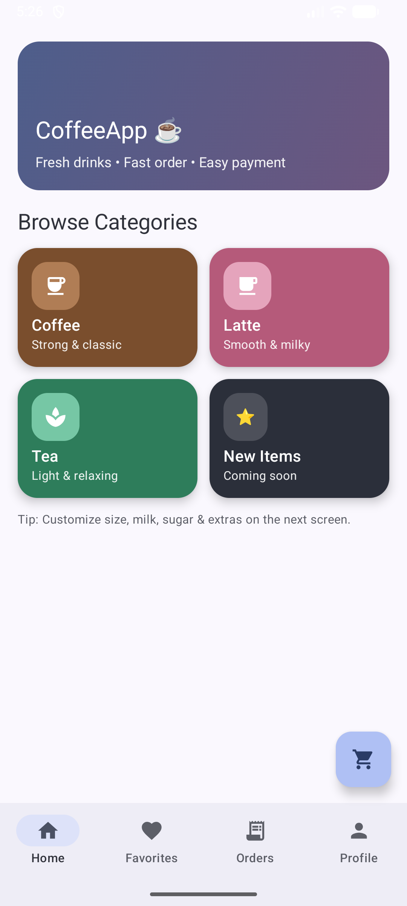
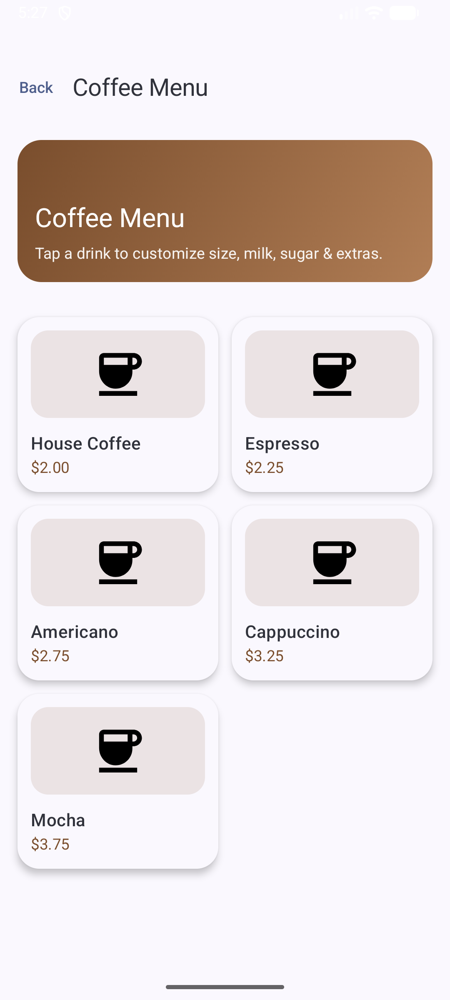
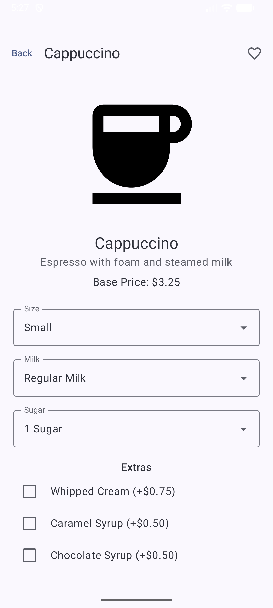
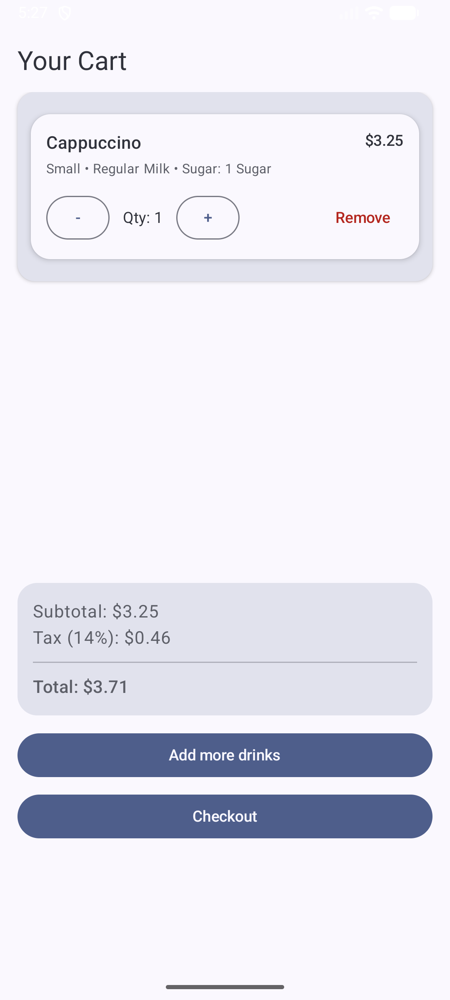
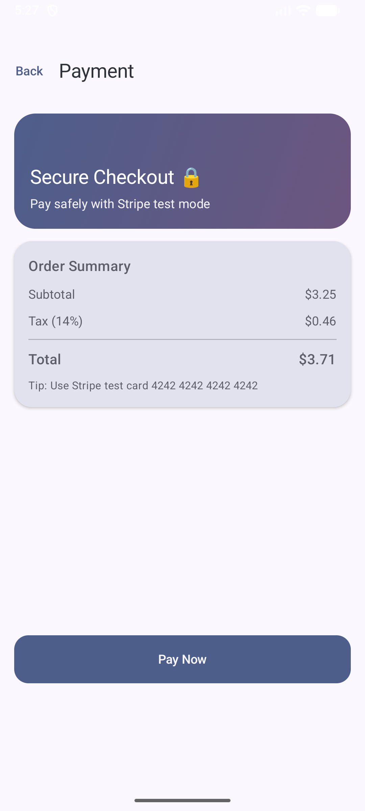
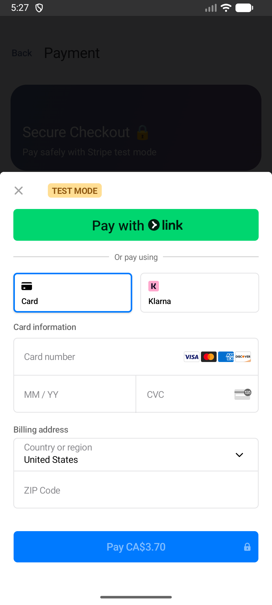
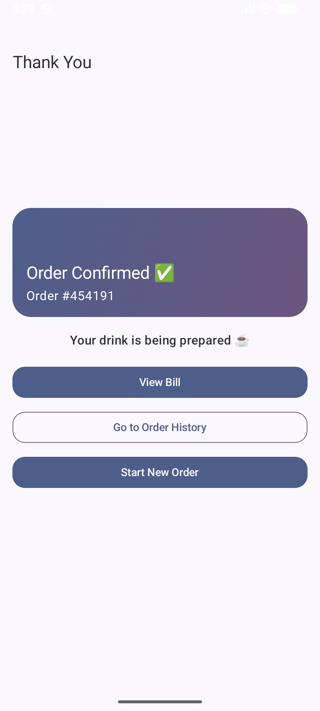
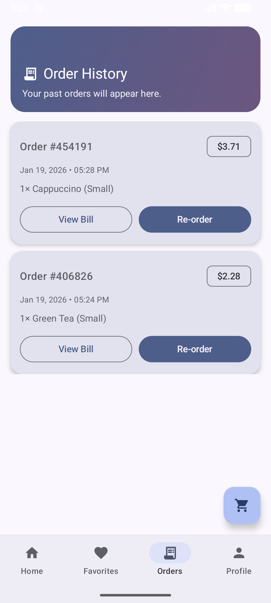
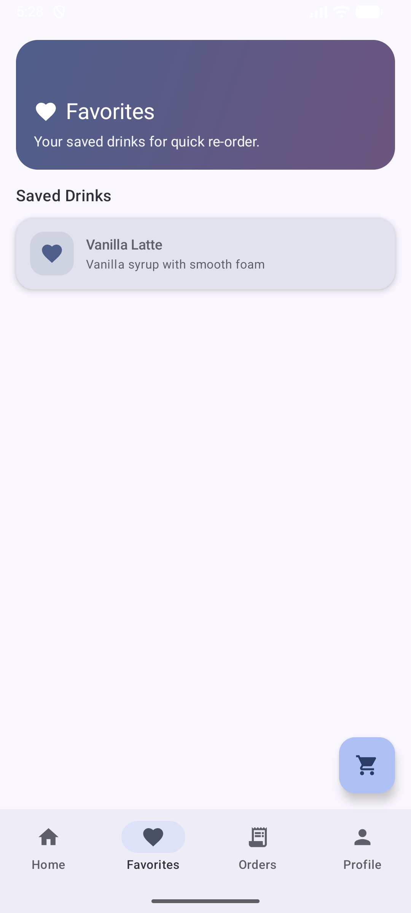
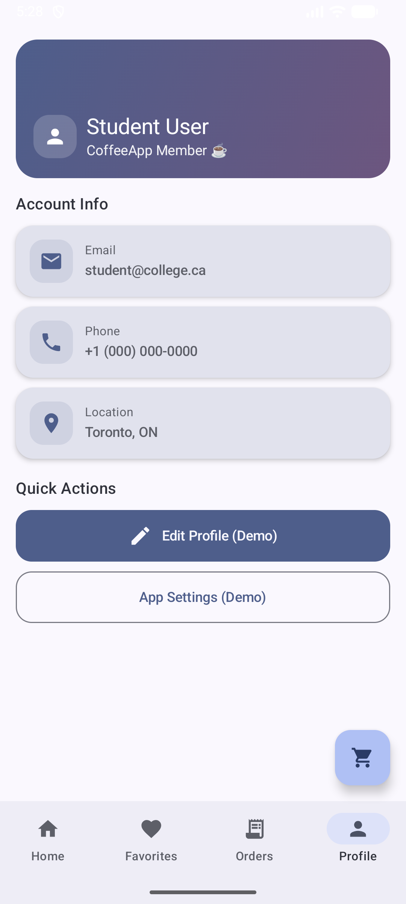

# ☕ CoffeeApp — Modern Coffee Ordering App


A **modern Android coffee ordering application** built with **Jetpack Compose**.  
Users can browse drinks, customize orders, manage favorites, place secure payments using **Stripe**, and view order history with re‑order support.

---

## 🎥 Video Presentation

▶️ **Watch Demo Video:**  
https://youtube.com/shorts/lYteEbKk_TE

---

## 📱 App Screenshots

### 🏠 Home Screen


### ☕ Drink Categories


### 📋 Drink Menu


### 🧩 Drink Customization


### ❤️ Favorites


### 🛒 Cart Screen


### 🧾 Review Order


### 💳 Payment Screen


### ✅ Thank You Screen


### 📜 Order History


## 🧪 Stripe Test Card

Use the following test card for payment:
Card Number: 4242 4242 4242 4242
Expiry Date: Any future date
CVV: Any 3 digits

---

## ✨ Features

- 🏠 **Home Dashboard**
  - Browse coffee, latte, and tea categories
- ☕ **Drink Customization**
  - Size, milk type, sugar level, and extras
- ❤️ **Favorites**
  - Save drinks for quick re‑order
- 🛒 **Smart Cart**
  - Quantity control, tax calculation, total summary
- 💳 **Stripe Payments (Test Mode)**
  - Secure checkout using Stripe PaymentSheet
- 📜 **Order History**
  - View previous orders
  - Re‑order with one tap
- 🧾 **Bill Screen**
  - Clean, readable receipt UI
- 👤 **Profile Screen**
  - User info and demo settings
- 🎨 **Modern UI**
  - Material 3, gradients, rounded cards, clean spacing

---

## 🧠 Architecture & Tech Stack

- **Language:** Kotlin
- **UI:** Jetpack Compose (Material 3)
- **Navigation:** Navigation Compose
- **State:** State hoisting + managers
- **Payments:** Stripe Android SDK (PaymentSheet)
- **Architecture:** UI + Data Managers (Assignment‑friendly)
- **Min SDK:** 26

---

## 🗂️ Project Structure

```
com.assignment2.coffeeapp
│
├── data/
│   ├── Drink.kt
│   ├── CartManager.kt
│   ├── OrderHistoryManager.kt
│   └── enums (Size, Milk, Sugar, Extras)
│
├── ui/
│   ├── home/
│   ├── drinks/
│   ├── details/
│   ├── cart/
│   ├── payment/
│   ├── thankyou/
│   ├── history/
│   ├── favorites/
│   ├── bill/
│   └── profile/
│
├── navigation/
│   ├── MainScaffold.kt
│   └── BottomNavItem.kt
│
└── viewmodel/
    └── PaymentViewModel.kt
```

---

## ⚙️ Setup Instructions

1. Clone the repository
   ```bash
   git clone https://github.com/brijpatel88/Assignment2.git
   ```

2. Open in **Android Studio**
3. Sync Gradle
4. Run on emulator or physical device (API 26+)
5. For payment testing, use Stripe test card:
   ```
   4242 4242 4242 4242
   Any future date | Any CVC
   ```

---

## 📝 Notes

- Payments are in **Stripe Test Mode**
- Data persistence is **in‑memory** (assignment scope)
- Designed for **educational and portfolio use**

---

## 📄 License

```
Copyright (c) 2026 Brijesh Patel

All rights reserved.

This software and associated source code (the "Software") are proprietary
and confidential. Unauthorized copying, modification, distribution,
public display, or commercial use of this Software, in whole or in part,
is strictly prohibited without prior written permission from the author.

This repository is provided solely for:
- Educational purposes
- Portfolio demonstration
- Code review and learning reference

NO LICENSE is granted for commercial use, redistribution, or derivative works.
```

---

☕ *Thank you for reviewing CoffeeApp!*  
If this were a real café — your order would already be ready 😄
